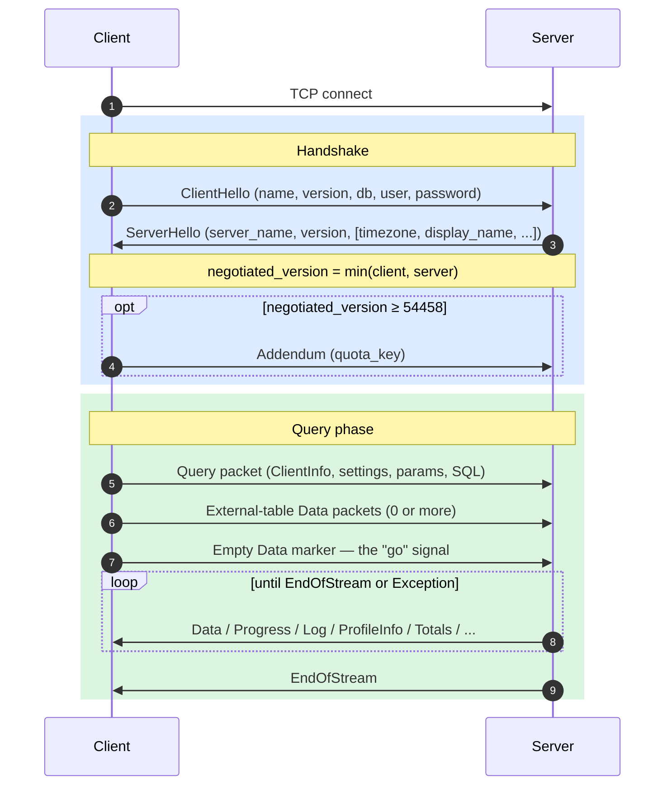
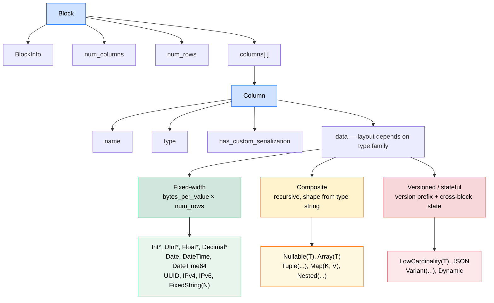

# ch-proto

A from-scratch implementation and language-agnostic specification of the **ClickHouse native TCP protocol** and **Native columnar format**, built phase-by-phase against a real ClickHouse server.

Two parallel deliverables:

- A spec — `NATIVE_PROTOCOL.md`, `NATIVE_FORMAT.md`, `IMPLEMENTATION_NOTES.md` — that is self-contained and implementation-neutral.
- A Rust client (`src/`) that exists primarily to validate the spec end-to-end against a real server.

**Methodology** I wrote the specifications in phases (see `DESIGN.md`). Implementing from primitives (like encodings on the wire), Connection state machines, Different clickhouse data types, supporting different feature gates, etc.

**Target:** protocol version `54483` (the current ClickHouse server revision).

**Scope is deliberately narrow.** 
1. This is purely TCP protocol only
2. There are non-goals. Full non-goals in [`DESIGN.md`](DESIGN.md) "Scope boundaries".

---

## Mental model

If you only read one section, read this one. Three ideas — connection lifecycle, the Native format, and feature-gated versioning — are enough to navigate everything else.

### Connection lifecycle

A connection is `TCP connect → handshake → (Ping | Query)* → close` (see the image below).

**Handshake.** 

1. Client sends `ClientHello` (name, version, protocol_version, db/user/password). 
2. Server replies with `ServerHello`. 
3. Both sides compute `negotiated_version = min(client, server)` and use it for every subsequent feature gate. 
4. If `negotiated_version ≥ 54458`, the client follows up with an **Addendum** (a single `quota_key` string, no packet-type prefix).

**Query phase** is a small state machine. 

1. Client ships a Query packet (carrying `ClientInfo`, settings, parameters, the SQL body).
2. Then zero or more external-table Data packets, then an **empty Data marker**. 
3. The empty marker is the "go" signal — the server doesn't begin executing until it sees it, even for SELECTs with no input. 
4. Server then streams response packets (`Data`, `Progress`, `ProfileInfo`, `Log`, `ProfileEvents`, `Totals`, `Extremes`, …) until `EndOfStream` or `Exception`. **`num_rows == 0` is *not* a terminator** — only `EndOfStream`/`Exception` ends the stream.

**INSERT phase** mirrors SELECT but adds a schema exchange: server sends a 0-row Data block describing the expected columns, client ships one or more data blocks, then the empty Data marker, then the server replies with `EndOfStream`.



### The Native format

Everything carrying rows on the wire is a **Block**:

```
Block = (BlockInfo, num_columns, num_rows, columns[])
Column = (name, type, has_custom_serialization, data)
```

Types fall in three families. The family decides how `data` is laid out:

- **Fixed-width** (`Int8`–`Int256`, `UInt8`–`UInt256`, `Float32/64`, `Date`, `DateTime`, `DateTime64`, `Decimal*`, `UUID`, `IPv4/6`, `FixedString(N)`): `bytes_per_value × num_rows` raw bytes. No per-row framing.
- **Composite** (`Nullable(T)`, `Array(T)`, `Tuple(...)`, `Map(K,V)`, `Nested(...)`): a stable recursive shape that's fully derivable from the type string. E.g. `Array(T)` is `[num_rows × UInt64 cumulative offsets][inner T values]`; `Nullable(T)` is `[num_rows × UInt8 null map][inner T values for all rows]`.
- **Versioned / stateful** (`LowCardinality(T)`, `JSON`, `Variant(...)`, `Dynamic`): start with a serialization-version prefix and may carry **cross-block state**. E.g. a `LowCardinality` dictionary accumulates new keys across blocks within a single query response — you cannot decode block N+1 without remembering block N.



The colors above grade by complexity: green = pure layout from row count, amber = recursive layout from type string, red = stateful and version-gated.

**Compression** is an optional outer **frame** wrapping each block payload: `[16-byte CityHash128 checksum][1-byte method][4-byte compressed size][4-byte uncompressed size][body]`. Method bytes: `0x82` LZ4, `0x90` ZSTD, `0x02` NONE. Opted in via the `compression` flag in the Query packet.

### Versioning by feature gates

The protocol version is a monotonically increasing integer. Each new version adds **optional** fields gated on the negotiated version. There are no backwards-incompatible breaks — older clients simply see fewer fields. The canonical feature table is `NATIVE_PROTOCOL.md` §3.3.

The implication for implementers: every encode/decode of a versioned message must consult the negotiated version, not the client's *declared* version. Get this wrong and every subsequent byte misaligns.

---

## Repo layout

| Path | What |
|------|------|
| [`NATIVE_PROTOCOL.md`](NATIVE_PROTOCOL.md) | TCP wire protocol — framing, lifecycle, message bodies, configuration, packet reference |
| [`NATIVE_FORMAT.md`](NATIVE_FORMAT.md) | Columnar data format — wire primitives, Block/Column, types, compression |
| [`IMPLEMENTATION_NOTES.md`](IMPLEMENTATION_NOTES.md) | Symptom/Cause/Fix gotchas + reference Rust client status |
| [`SPEC.md`](SPEC.md) | Thin redirect to the three above |
| [`DESIGN.md`](DESIGN.md) | Build plan — 13 phases, 73 problems, full status table |
| `src/` | Rust client (single-threaded, blocking, TCP-only) |
| `examples/` | Worked queries — `events.rs`, `catalog.rs` |
| `tests/` | Integration tests (run against a live container) |
| `Makefile` | `make up`, `make test-unit`, `make test-integration` |

---

## Reading paths

The two tracks below are signposts into the existing spec, not a re-explanation. Pick the one that matches your goal.

### Track A — "I want to learn the protocol"

1. Re-read the **Mental model** section above. That's the spine.
2. [`NATIVE_PROTOCOL.md`](NATIVE_PROTOCOL.md) §1 *Overview* → §5 *Connection Lifecycle* — the narrative arc end-to-end.
3. [`NATIVE_FORMAT.md`](NATIVE_FORMAT.md) §1 *Wire Primitives* → §2 *Block & Column* → §3.1 *Fixed-width* → §3.3 *Composite* — the data side, in an order that builds on itself.
4. [`NATIVE_PROTOCOL.md`](NATIVE_PROTOCOL.md) §6 *Message Reference* — flip to it when you want the exact field list of a specific message.
5. [`NATIVE_FORMAT.md`](NATIVE_FORMAT.md) §3.4 *Versioned types* and §4 *Compression* — the harder material, once the basics click.
6. [`IMPLEMENTATION_NOTES.md`](IMPLEMENTATION_NOTES.md) — consult only when something on the wire isn't behaving as the spec describes. It's a debug-pointer document, not normative spec.
7. `examples/events.rs` and `examples/catalog.rs` — watch the lifecycle running end-to-end against a real server.

### Track B — "I want to review the spec"

**Coverage matrix** (rolled up from [`DESIGN.md`](DESIGN.md)'s phase table):

| Spec area | Where | Status |
|-----------|-------|--------|
| Wire primitives, Block & Column structure | `NATIVE_FORMAT.md` §1–§2 | ✅ Complete |
| Connection lifecycle (Hello, Ping, Query, INSERT) | `NATIVE_PROTOCOL.md` §5 | ✅ Complete |
| Fixed-width + variable-length + composite types | `NATIVE_FORMAT.md` §3.1–§3.3 | ✅ Complete |
| Versioned / stateful types | `NATIVE_FORMAT.md` §3.4 | ⚠️ LowCardinality + JSON Tier 1 spec'd; Variant, Dynamic, JSON Tier 2/3 deferred (rationale in §3.4.5) |
| Compression frame | `NATIVE_FORMAT.md` §4 | ✅ Frame format spec'd; client-side connection integration pending |
| v54461–v54483 feature additions | `NATIVE_PROTOCOL.md` §3.3 + various | ⏳ Most pending — see [`DESIGN.md`](DESIGN.md) Phase 11 |
| Chunked protocol (v54470) | `NATIVE_PROTOCOL.md` §4–§5 | ⏳ Not yet documented |

**Known gaps to focus review on:**

- `NATIVE_FORMAT.md` §3.4 — the deferred-types rationale. Are the boundaries between Tier 1/2/3 JSON drawn correctly?
- `NATIVE_PROTOCOL.md` §3.3 — the feature table currently caps at v54460-era features. Anything added v54461 → v54483 likely needs a row.
- Anything marked ⏳ above.

**Verifying a spec claim — cross-reference order:**

1. **ClickHouse C++ source** (`~/src/ClickHouse/src/`) — authoritative at v54483.
2. **ch-go** (`~/src/ch-go/main/proto/`) — minimalist Go reference, covers up to v54460. Good for primitives and the basic message bodies.
3. **clickhouse-go** (`~/src/clickhouse-go/main/`) — production Go driver, covers ~v54483 including full JSON/Variant/Dynamic. Use this when verifying anything Tier 2+.

For per-problem status (each of 73 implementation problems carries a `Spec work:` annotation pointing at the relevant spec section), see [`DESIGN.md`](DESIGN.md).

---

## Build & run

```sh
make up                 # start ClickHouse via docker-compose
make test-unit          # cargo test
make test-integration   # against the running container
cargo run --example events
```

---

## TODOs — bringing the spec to v54483 parity

The spec today caps at v54460 protocol features in `NATIVE_PROTOCOL.md` §3.3 and is partial in `NATIVE_FORMAT.md` §3.4. The list below is what's left to reach the current server target (`54483`). Each item maps back to a numbered problem in [`DESIGN.md`](DESIGN.md)

### Native format — versioned types (`NATIVE_FORMAT.md` §3.4)

- [ ] **`Variant(T1, T2, …)`** — BASIC + COMPACT discriminator modes, sub-column dispatch 
- [ ] **`Dynamic`** — version prefix, runtime-discovered type list, cross-block growth (depends on Variant)
- [ ] **`JSON` Tier 2** (FLATTENED mode) — path list + per-path Dynamic + shared-data column (depends on LowCardinality + Variant + Dynamic)

### Native protocol — chunked framing (the big one)

- [ ] **v54470 chunked protocol** *(P53)* — per-packet chunk framing (`[chunk_size][bytes][zero terminator]`) plus Addendum negotiation (`proto_send_chunked` / `proto_recv_chunked`). Touches `NATIVE_PROTOCOL.md` §4 (Packet Envelope) and §5 (Connection Lifecycle).

### Native protocol — message-body field additions (minor)

External-client-facing:
- [ ] v54461 — `ServerHello` password complexity rules
- [ ] v54463 — `Progress.total_bytes_to_read`
- [ ] v54464 — `TimezoneUpdate` server packet
- [ ] v54465 — sparse serialization in `Column`
- [ ] v54466 — SSH challenge/response auth packets
- [ ] v54469 — `ProfileInfo.applied_aggregation` + `rows_before_aggregation`
- [ ] v54473 — V2 Dynamic / JSON serialization-version branches
- [ ] v54474 — server settings list trailing `ServerHello`
- [ ] v54475 — `ClientInfo.script_query_number` + `script_line_number`
- [ ] v54478 — binary type encoding alternative in `Column`
- [ ] v54481 — optional compression on `Log` / `ProfileEvents` block bodies
- [ ] v54483 — `Nullable(T)` + sparse serialization composition

