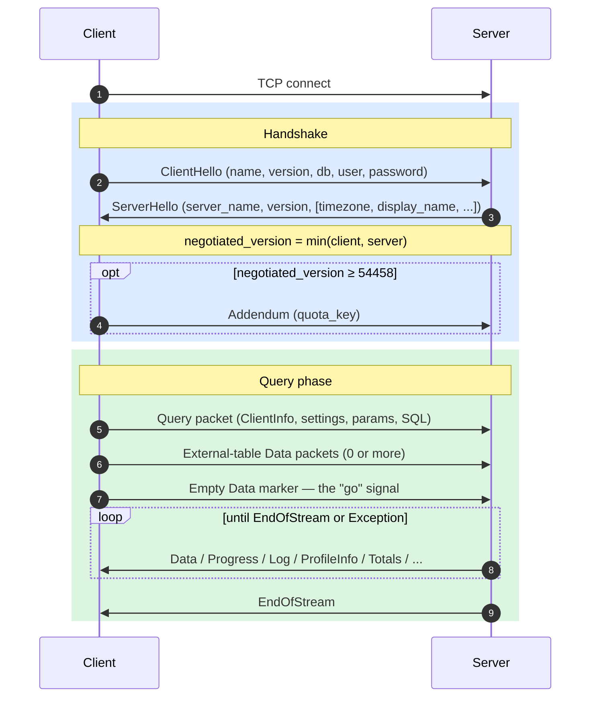
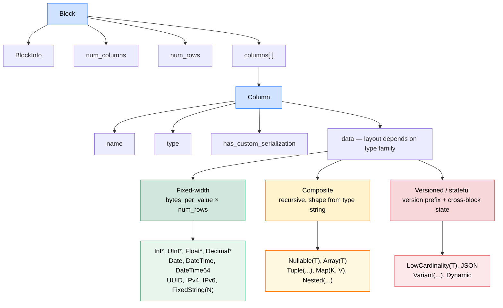

**This Repository is deprecated and no longer used for any purposes. The specifications that came out of it is [already merged and part of ClickHouse core repository](https://github.com/ClickHouse/ClickHouse/pull/106720)**

# ch-proto

A from-scratch implementation and language-agnostic specification of the **ClickHouse native TCP protocol** and **Native columnar format**, built phase-by-phase against a real ClickHouse server.

Two parallel deliverables:

- A spec — `NATIVE_PROTOCOL.md`, `NATIVE_FORMAT.md`, `IMPLEMENTATION_NOTES.md` — that is self-contained and implementation-neutral.
- A Rust client (`src/`) that exists primarily to validate the spec end-to-end against a real server.

**Methodology** I wrote the specifications in phases (see `DESIGN.md`). Implementing from primitives (like encodings on the wire), Connection state machines, Different clickhouse data types, supporting different feature gates, etc.

**Target:** protocol version `54483` (the current ClickHouse server revision).

**Scope is deliberately narrow.** 
1. This is purely TCP protocol only
2. There are non-goals. Full non-goals in [`DESIGN.md`](DESIGN.md) "Scope boundaries".

---

## Mental model

If you only read one section, read this one. Three ideas — connection lifecycle, the Native format, and feature-gated versioning — are enough to navigate everything else.

### Connection lifecycle

A connection is `TCP connect → handshake → (Ping | Query)* → close` (see the image below).

**Handshake.** 

1. Client sends `ClientHello` (name, version, protocol_version, db/user/password). 
2. Server replies with `ServerHello`. 
3. Both sides compute `negotiated_version = min(client, server)` and use it for every subsequent feature gate. 
4. If `negotiated_version ≥ 54458`, the client follows up with an **Addendum** (a single `quota_key` string, no packet-type prefix).

**Query phase** is a small state machine. 

1. Client ships a Query packet (carrying `ClientInfo`, settings, parameters, the SQL body).
2. Then zero or more external-table Data packets, then an **empty Data marker**. 
3. The empty marker is the "go" signal — the server doesn't begin executing until it sees it, even for SELECTs with no input. 
4. Server then streams response packets (`Data`, `Progress`, `ProfileInfo`, `Log`, `ProfileEvents`, `Totals`, `Extremes`, …) until `EndOfStream` or `Exception`. **`num_rows == 0` is *not* a terminator** — only `EndOfStream`/`Exception` ends the stream.

**INSERT phase** mirrors SELECT but adds a schema exchange: server sends a 0-row Data block describing the expected columns, client ships one or more data blocks, then the empty Data marker, then the server replies with `EndOfStream`.



### The Native format

Everything carrying rows on the wire is a **Block**:

```
Block = (BlockInfo, num_columns, num_rows, columns[])
Column = (name, type, has_custom_serialization, data)
```

Types fall in three families. The family decides how `data` is laid out:

- **Fixed-width** (`Int8`–`Int256`, `UInt8`–`UInt256`, `Float32/64`, `Date`, `DateTime`, `DateTime64`, `Decimal*`, `UUID`, `IPv4/6`, `FixedString(N)`): `bytes_per_value × num_rows` raw bytes. No per-row framing.
- **Composite** (`Nullable(T)`, `Array(T)`, `Tuple(...)`, `Map(K,V)`, `Nested(...)`): a stable recursive shape that's fully derivable from the type string. E.g. `Array(T)` is `[num_rows × UInt64 cumulative offsets][inner T values]`; `Nullable(T)` is `[num_rows × UInt8 null map][inner T values for all rows]`.
- **Versioned / stateful** (`LowCardinality(T)`, `JSON`, `Variant(...)`, `Dynamic`): start with a serialization-version prefix and may carry **cross-block state**. E.g. a `LowCardinality` dictionary accumulates new keys across blocks within a single query response — you cannot decode block N+1 without remembering block N.



The colors above grade by complexity: green = pure layout from row count, amber = recursive layout from type string, red = stateful and version-gated.

**Compression** is an optional outer **frame** wrapping each block payload: `[16-byte CityHash128 checksum][1-byte method][4-byte compressed size][4-byte uncompressed size][body]`. Method bytes: `0x82` LZ4, `0x90` ZSTD, `0x02` NONE. Opted in via the `compression` flag in the Query packet.

### Versioning by feature gates

The protocol version is a monotonically increasing integer. Each new version adds **optional** fields gated on the negotiated version. There are no backwards-incompatible breaks — older clients simply see fewer fields. The canonical feature table is `NATIVE_PROTOCOL.md` §3.3.

The implication for implementers: every encode/decode of a versioned message must consult the negotiated version, not the client's *declared* version. Get this wrong and every subsequent byte misaligns.

---

## Repo layout

| Path | What |
|------|------|
| [`NATIVE_PROTOCOL.md`](NATIVE_PROTOCOL.md) | TCP wire protocol — framing, lifecycle, message bodies, configuration, packet reference |
| [`NATIVE_FORMAT.md`](NATIVE_FORMAT.md) | Columnar data format — wire primitives, Block/Column, types, compression |
| [`IMPLEMENTATION_NOTES.md`](IMPLEMENTATION_NOTES.md) | Symptom/Cause/Fix gotchas + reference Rust client status |
| [`SPEC.md`](SPEC.md) | Thin redirect to the three above |
| [`DESIGN.md`](DESIGN.md) | Build plan — 13 phases, 73 problems, full status table |
| `src/` | Rust client (single-threaded, blocking, TCP-only) |
| `examples/` | Worked queries — `events.rs`, `catalog.rs` |
| `tests/` | Integration tests (run against a live container) |
| `Makefile` | `make up`, `make test-unit`, `make test-integration` |

---

## Reading paths

The two tracks below are signposts into the existing spec, not a re-explanation. Pick the one that matches your goal.

### Track A — "I want to learn the protocol"

1. Re-read the **Mental model** section above. That's the spine.
2. [`NATIVE_PROTOCOL.md`](NATIVE_PROTOCOL.md) §1 *Overview* → §5 *Connection Lifecycle* — the narrative arc end-to-end.
3. [`NATIVE_FORMAT.md`](NATIVE_FORMAT.md) §1 *Wire Primitives* → §2 *Block & Column* → §3.1 *Fixed-width* → §3.3 *Composite* — the data side, in an order that builds on itself.
4. [`NATIVE_PROTOCOL.md`](NATIVE_PROTOCOL.md) §6 *Message Reference* — flip to it when you want the exact field list of a specific message.
5. [`NATIVE_FORMAT.md`](NATIVE_FORMAT.md) §3.4 *Versioned types* and §4 *Compression* — the harder material, once the basics click.
6. [`IMPLEMENTATION_NOTES.md`](IMPLEMENTATION_NOTES.md) — consult only when something on the wire isn't behaving as the spec describes. It's a debug-pointer document, not normative spec.
7. `examples/events.rs` and `examples/catalog.rs` — watch the lifecycle running end-to-end against a real server.

### Track B — "I want to review the spec"

**Coverage matrix** (rolled up from [`DESIGN.md`](DESIGN.md)'s phase table):

| Spec area | Where | Status |
|-----------|-------|--------|
| Wire primitives, Block & Column structure | `NATIVE_FORMAT.md` §1–§2 | ✅ Complete |
| Connection lifecycle (Hello, Ping, Query, INSERT) | `NATIVE_PROTOCOL.md` §5 | ✅ Complete |
| Fixed-width + variable-length + composite types | `NATIVE_FORMAT.md` §3.1–§3.3 | ✅ Complete |
| Versioned / stateful types | `NATIVE_FORMAT.md` §3.4 | ✅ LowCardinality, JSON Tier 1, Variant (BASIC), Dynamic (FLATTENED), JSON Tier 2 (FLATTENED Object) — all leaf/single-block; non-flat JSON + Tier 3 deferred (§3.4.8) |
| Compression frame | `NATIVE_FORMAT.md` §4 | ✅ Frame format + read-path integration (decompress responses, LZ4/ZSTD/NONE); compressed INSERT deferred (§4.6) |
| v54461–v54483 feature additions | `NATIVE_PROTOCOL.md` §3.3 + various | ✅ Complete — feature table extends to v54482; v54483 (nullable sparse) in `NATIVE_FORMAT.md` §2.3.1. See [`DESIGN.md`](DESIGN.md) Phase 11 (Problems 46–65) |
| Chunked protocol (v54470) | `NATIVE_PROTOCOL.md` §4.1 | ✅ Spec'd (framing + negotiation) and fully implemented |

**Known gaps to focus review on:**

- [`NESTED_STATEFUL_DESIGN.md`](NESTED_STATEFUL_DESIGN.md) — the largest open item: versioned types (LowCardinality/Variant/Dynamic/JSON) **nested in composites**, **multi-block**, or **replicated/const-wrapped**. The flat decoder reads state-prefix-then-data inline, but ClickHouse batches all prefixes first; design + ~106 target tests (`tests/differential/nested_stateful.txt`) are written, implementation is pending. Allocation guards make the desync fail cleanly instead of aborting.
- `NATIVE_FORMAT.md` §3.4 — the deferred-types rationale. Are the boundaries between Tier 1/2/3 JSON drawn correctly?
- `NATIVE_FORMAT.md` §4 — compression read path is integrated; compressed INSERT (write path) is deferred (§4.6).
- `AggregateFunction` and `QBit` raw state are undecoded (`NATIVE_FORMAT.md` §3.1.15).

**Verifying a spec claim — cross-reference order:**

1. **ClickHouse C++ source** (`~/src/ClickHouse/src/`) — authoritative at v54483.
2. **ch-go** (`~/src/ch-go/main/proto/`) — minimalist Go reference, covers up to v54460. Good for primitives and the basic message bodies.
3. **clickhouse-go** (`~/src/clickhouse-go/main/`) — production Go driver, covers ~v54483 including full JSON/Variant/Dynamic. Use this when verifying anything Tier 2+.

For per-problem status (each of 73 implementation problems carries a `Spec work:` annotation pointing at the relevant spec section), see [`DESIGN.md`](DESIGN.md).

---

## Build & run

```sh
make up                 # start ClickHouse via docker-compose
make test-unit          # cargo test
make test-integration   # against the running container
cargo run --example events
```

---

## How the specifications are validated

The spec is not validated by reading — it's validated by a Rust client (`src/`) that implements it against a real ClickHouse server. Two layers:

**1. Hand-written tests.** 351 unit tests pin individual encodings and message bodies (VarUInt round-trips, each data-type codec, handshake and feature-gate logic); 100 integration tests run real queries against a live container (`make test-integration`). These reach corners a query corpus can't — REPLICATED inner types the server only emits in narrow cases, empty `Tuple()`, and so on.

**2. Differential harness against ClickHouse's own test suite.** The strongest signal: replay ClickHouse's `tests/queries/0_stateless` query corpus through our client and diff the rendered output, byte-for-byte, against the `.reference` file the ClickHouse team commits next to each test. If our decode of any type or packet is wrong, the rows diverge from the reference and the test fails. `ch-tsv` (`src/bin/ch-tsv.rs`) is the wrapper — it runs a `.sql` file through the client and prints TSV; `run.sh` wraps each test in a per-test ephemeral database (`CREATE DATABASE test_<pid>_<n>; USE …; DROP DATABASE` — the same envelope the canonical `clickhouse-test` runner uses), diffs stdout against the reference, and buckets the result (PASS / MISMATCH / SERVER_ERROR / IO_ERROR / CRASH). It runs parallel-8; each test has its own database, so there's no cross-test state.

### How the 4,463 tests were chosen

Most stateless tests don't exercise *our* code. They depend on the environment, the SQL dialect, the server version, or a `clickhouse-client` CLI feature, and would pass or fail no matter what our client does — so they carry no signal about the protocol or format. The selection criterion throughout is one rule: **a test earns its place only if its pass/fail depends on our native-protocol/native-format code.** Two passes apply it.

| Stage | Tests | What happens |
|-------|------:|--------------|
| `0_stateless` `.sql` corpus | 8,522 | Every SQL test in the suite (the `.sh`/`.py`/`.expect` tests aren't SQL and aren't run). |
| Static filter — `make corpus-filter` | 4,947 | Drop the tests whose outcome can't depend on our code, judged from the SQL text alone. |
| Runtime prune — `classify.sh` | 4,481 | Drop the no-value failures that only surface at runtime (−466, recorded in `corpus_excluded.tsv`). |
| Scored | **4,463** | Minus 18 tests that ship without a `.reference` to diff against. |

The **static filter** (rules inline in the `Makefile`) drops, by grepping the SQL: `FORMAT JSON/CSV/Pretty/…` clauses (they test the *server's* output formatters, not our client); `ATTACH`/`DETACH`/`GRANT`/`REVOKE`/`EXPLAIN`; `-- Tags:` tests (need the `test.hits`/`visits` datasets or a cluster); instance-specific `system.*` tables and non-deterministic functions (`now()`, `rand()`, `generateUUIDv4()`, `currentDatabase()`, …) whose output isn't reproducible; `ENGINE = Replicated*` (needs ZooKeeper); `dialect = 'kusto'|'prql'` (a different parser, not native format); `{CLICKHOUSE_DATABASE}`-style parameter substitutions (the official runner fills these, our harness can't); and `-- { echo }` / `-- { echoOn }` (a CLI feature that echoes query text into the output).

The **runtime prune** catches what only the *failure reason* reveals — cluster-not-found, functions missing on this server version, server-side analyzer crashes, non-UTF-8 test files. `classify.sh` tags every non-PASS by root cause and moves the no-value ones (466) into `corpus_excluded.tsv`; the largest bucket there is `-- { echo }` artifacts (224) that slipped past the text filter.

### Why the remaining tests fail

Current score: **4,201 / 4,463 = 94.1%**. The 262 remaining failures, by `classify.sh` root cause:

| Bucket | Count | Verdict |
|--------|------:|---------|
| `REAL_FORMAT_MISMATCH`    | 126 | Rendered output differs — the nested-stateful decode gap, plus known best-effort TSV-formatting differences |
| `CLIENT_TYPE_UNSUPPORTED` |  40 | Types we deliberately don't decode yet (`AggregateFunction`, `QBit`) |
| `ENV_SERVER_ANALYZER`     |  23 | Server-side analyzer/version difference — no protocol/format value |
| `CLIENT_UTF8_DECODE`      |  19 | Non-UTF-8 `String` payload; the TSV path assumes UTF-8 |
| `CLIENT_LC_PREFIX`        |  18 | `LowCardinality` state prefix in a nested / multi-block layout |
| `ARTIFACT_ECHO`           |  15 | `clickhouse-client` echo artifact the static filter missed — no value |
| `CLIENT_DECODE_BUG`       |   9 | Array-offset / replicated decode edge cases |
| `CLIENT_JSON_VER`         |   8 | JSON serialization version not yet handled (non-flat / Tier 3) |
| `TIMEOUT`                 |   3 | Slow or hung query (e.g. the INSERT-no-data hang) |
| `ENV_ZK`                  |   1 | Needs ZooKeeper — no value |
| **Total**                 | **262** | |

Of these, **39** are environment/CLI noise that merely leaked past the filters (`ENV_SERVER_ANALYZER` + `ARTIFACT_ECHO` + `ENV_ZK`) and carry no signal. The genuine ~223 client gaps are dominated by:

- **Nested-stateful decode** — the single largest open item. Versioned types (LowCardinality / Variant / Dynamic / JSON) nested inside composites, spanning multiple blocks, or const/replicated-wrapped. The flat decoder reads *state-prefix-then-data* inline, but ClickHouse batches all prefixes first; design and ~106 target tests are written ([`NESTED_STATEFUL_DESIGN.md`](NESTED_STATEFUL_DESIGN.md), `tests/differential/nested_stateful.txt`), implementation pending. Surfaces as `REAL_FORMAT_MISMATCH`, `CLIENT_LC_PREFIX`, `CLIENT_JSON_VER`, and some `CLIENT_DECODE_BUG`.
- **Deliberately deferred types** — `AggregateFunction` intermediate state and `QBit`, whose wire forms are function/codec-specific (`NATIVE_FORMAT.md`, "Type aliases").
- **Non-UTF-8 `String` rendering** — the TSV formatter assumes UTF-8; binary String payloads need raw-byte output.
- **A few timeouts** — e.g. the INSERT-with-no-data hang documented in [`IMPLEMENTATION_NOTES.md`](IMPLEMENTATION_NOTES.md).

`REAL_FORMAT_MISMATCH` also folds in best-effort TSV-formatting differences (flat JSON objects, some float/edge cases) that are documented as not byte-identical to ClickHouse and are independent of decode correctness. See [`DESIGN.md`](DESIGN.md) for the full stage-by-stage history.

### Reproducing these numbers

Every count above comes from a local run — nothing is hand-maintained. The figures track the ClickHouse checkout you point `CLICKHOUSE_QUERIES` at (default `~/src/ClickHouse/tests/queries/0_stateless`); they're measured against ClickHouse `26.5`, and a different revision shifts the absolute totals. You need Docker and that source checkout.

```sh
# 1. Unit + integration tests (351 + 100). `test-integration` boots the server.
make test-unit
make test-integration

# 2. Differential score (4,201 PASS → 94.1%). Builds ch-tsv, boots the server,
#    runs the committed (already-pruned) corpus_filtered.txt parallel-8, and prints
#    the PASS / MISMATCH / SERVER_ERROR / IO_ERROR / CRASH summary.
make test-differential-full

# 3. Root-cause breakdown of the failures (the 262-row table above). Per-test tags
#    go to stdout; the summary table is printed to stderr.
tests/differential/classify.sh \
    "$HOME/src/ClickHouse/tests/queries/0_stateless" \
    tests/differential/corpus_filtered.txt > /dev/null
```

To reproduce the **selection funnel** (the `8,522 → 4,947` static-filter step), regenerate the list from your checkout:

```sh
make corpus-filter   # walks the .sql corpus, applies the static filter, reports the kept count
```

> `corpus-filter` overwrites `tests/differential/corpus_filtered.txt` with the raw static-filtered list (4,947), *before* the runtime prune. The committed `corpus_filtered.txt` (4,481) already has the 466 no-value tests removed — `git checkout tests/differential/corpus_filtered.txt` restores it if you only wanted to inspect the count. A leftover `test_*` database from an interrupted run can be swept with `make test-differential-cleanup`.

---

## Status & remaining work

The spec and client declare protocol version **`54484`** — the current server target (`PROGRESS_IN_ASYNC_INSERT`; upstream bumped `DBMS_TCP_PROTOCOL_VERSION` from 54483 to 54484). The v54461 → v54484 feature additions are complete (`NATIVE_PROTOCOL.md` §3.3 feature table extends to v54484; v54483 nullable-sparse is in `NATIVE_FORMAT.md` §2.3.1), the v54470 chunked protocol is fully implemented and spec'd (§4.1), and the REPLICATED column decoder (kind_stack `0x04`, v54482) is in place. Test coverage stands at **351 unit + 100 integration** tests passing and **94.1%** on the differential harness (see above).

What's left:

### Native format — versioned types (`NATIVE_FORMAT.md` §3.4), Phase 8 ✅ (partial)

- [x] **`Variant(T1, T2, …)`** — BASIC discriminator mode + sub-column dispatch (COMPACT mode and stateful elements deferred)
- [x] **`Dynamic`** — FLATTENED (v3) serialization for leaf runtime types (requested via the flattened-serialization setting); stateful runtime types and cross-block growth deferred
- [x] **`JSON` Tier 2** (FLATTENED Object) — typed paths + per-path `Dynamic`, leaf types, decode-only; non-flat (shared-data) V2/V3 and Tier 3 deferred

### Compression — connection integration (`NATIVE_FORMAT.md` §4), Phase 9 ⚠️

- [x] Read path: `compression = true` decompresses all response block bodies (LZ4/ZSTD/NONE) via a frame-streaming `CompressedReader`; the client-side empty marker is compressed as the server requires.
- [ ] Compressed INSERT (client→server data) — deferred; blocked on the parallel block-marshalling / `ColumnBLOB` path (v54478). Rejected with a clear error for now.

### Client polish (`DESIGN.md` Phase 12, Problems 66–69) ⏳

- [x] Problem 66 — client-side TCP keepalive (`SO_KEEPALIVE` / `TCP_KEEPIDLE` = 290s, via `socket2`) + `TCP_NODELAY`
- [ ] Problem 67 — `BufReader` / `BufWriter` around the stream
- [ ] Problem 68 — public API polish
- [ ] Problem 69 — benchmark vs. ch-go and clickhouse-go

